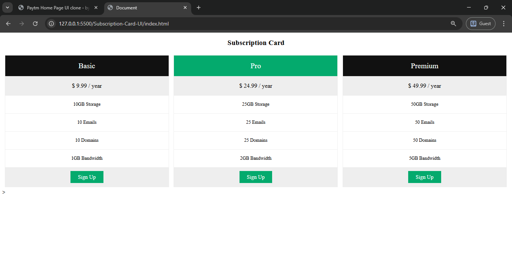

# Subscription Card UI

## Table of contents

- [Overview](#overview)
  - [The challenge](#the-challenge)
  - [Screenshot](#screenshot)
  - [Links](#links)
  - [Built with](#built-with)
- [Author](#author)

## Overview

A clean, responsive Subscription Card UI built with HTML and CSS for practice and portfolio demonstration.

### The challenge

- Build a visually appealing pricing table with a responsive layout.
- Ensure clean, readable structure for deployment on GitHub Pages.

### Screenshot

 

### Links

-  [Live Site URL](https://shrikanth-dev.github.io/Subscription-Card-UI/)
- [Solution URL](https://github.com/shrikanth-dev/Subscription-Card-UI)
### Built with

- Semantic HTML5
- CSS3 (Flexbox & Media Queries)
- Mobile-first responsive design

## Author

- LinkedIn - [@G Srikanth](https://www.linkedin.com/in/g-srikanth-gs)
